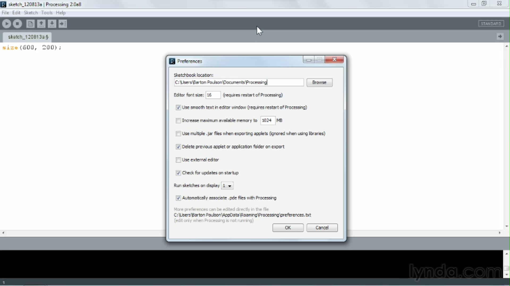

1. [Installing Processing](#1)
2. [Overview of Processing](#2)
3. [Exploring libraries](#3)

---

### 01 Installing Processing

- Download and install processing ide [click me](https://processing.org/download)

### 02 Overview of Processing

Preference setup

#### How to open sample sketch(project)

- Open file--> Examples--> _select any sketch_

### 03 Exploring libraries

#### How to import library in your sketch(project)

##### Javascript

- Open Sketch --> import library--> p5.sound

##### Java

- Open Sketch --> import library--> Serial

#### How to install libraries contributed by community

- Open Sketch --> import library--> manage libraries --> _select and install_

---

- [Processing Libraries reference documentation](https://processing.org/reference/libraries)
