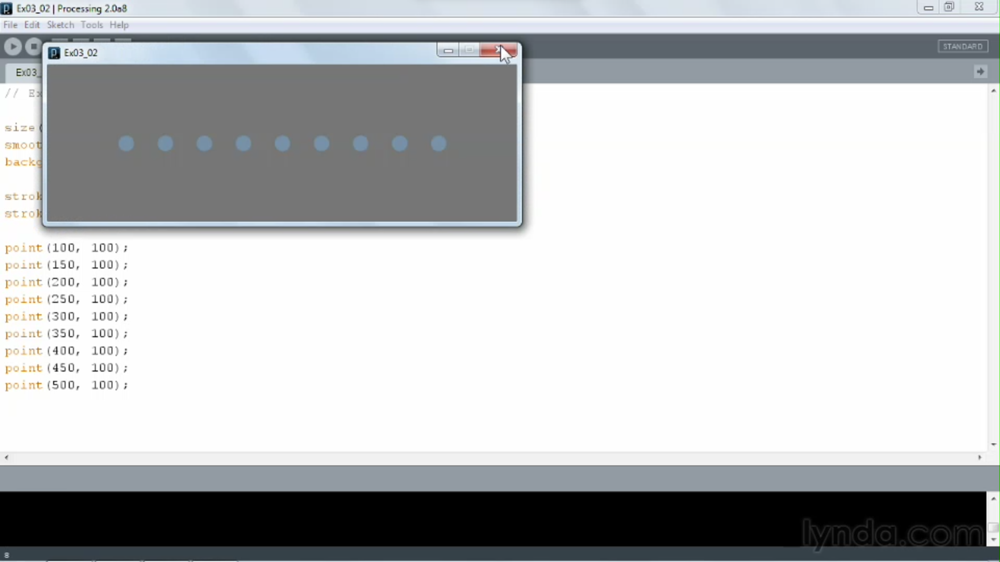
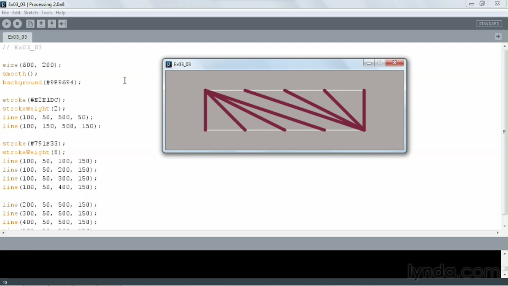
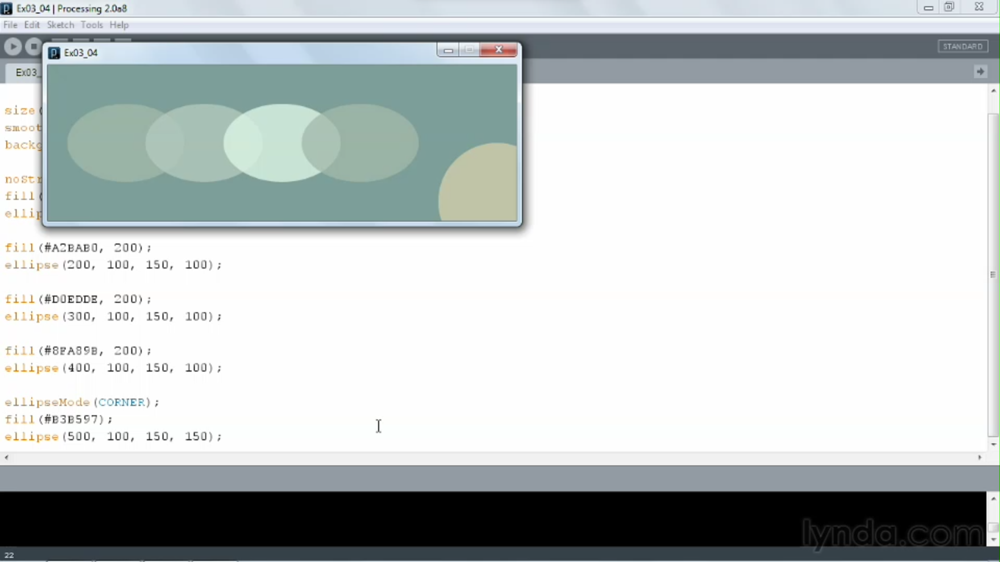
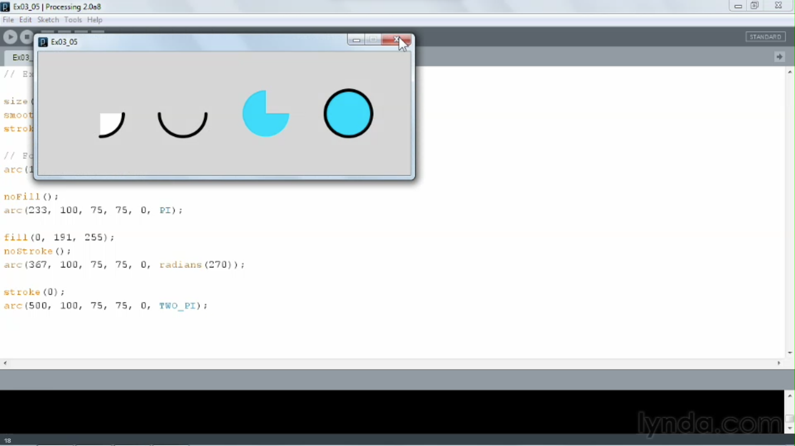

1. [Basic setup](#1)
2. [Drawing points](#2)
3. [Drawing lines](#3)
4. [Drawing ellipses and circles](#4)
5. [Drawing arcs](#5)
6. [Drawing rectangles and squares](#6)
7. [Drawing quadrangles](#7)
8. [Drawing triangles](#8)
9. [Drawing polygons](#9)
10. [Drawing simple curves](#10)
11. [Drawing complex curves](#11)
12. [Drawing Bézier curves](#12)

---

### 1 App: Basic setup<a id="1"></a>

- ellipse() function reference documentation [click me](https://processing.org/reference/ellipse_.html)

### 2 App: Drawing points<a id="2"></a>



```js
// Ex03_02

size(600, 200);
smooth();
background(#666666);

stroke(#607F9C);
strokeWeight(20);

point(100, 100);
point(150, 100);
point(200, 100);
point(250, 100);
point(300, 100);
point(350, 100);
point(400, 100);
point(450, 100);
point(500, 100);

```

- point() function reference documentation [click me](https://processing.org/reference/point_.html)

### 3 App: Drawing lines<a id="3"></a>



```js
// Ex03_03

size(600, 200);
smooth();
background(#9F9694);

stroke(#E2E1DC);
strokeWeight(2);
line(100, 50, 500, 50);
line(100, 150, 500, 150);

stroke(#791F33);
strokeWeight(8);
line(100, 50, 100, 150);
line(100, 50, 200, 150);
line(100, 50, 300, 150);
line(100, 50, 400, 150);

line(200, 50, 500, 150);
line(300, 50, 500, 150);
line(400, 50, 500, 150);
line(500, 50, 500, 150);

```

- line() function reference documentation [click me](https://processing.org/reference/line_.html)

### 4 App: Drawing ellipses and circles<a id="4"></a>



```js
// Ex03_04

size(600, 200);
smooth();
background(#678C8B);

noStroke();
fill(#8FA89B, 200);
ellipse(100, 100, 150, 100);

fill(#A2BAB0, 200);
ellipse(200, 100, 150, 100);

fill(#D0EDDE, 200);
ellipse(300, 100, 150, 100);

fill(#8FA89B, 200);
ellipse(400, 100, 150, 100);

ellipseMode(CORNER);
fill(#B3B597);
ellipse(500, 100, 150, 150);

```

- ellipse() function reference documentation [click me](https://processing.org/reference/ellipse_.html)

### 5 App: Drawing arcs<a id="5"></a>



```js
// Ex03_05

size(600, 200);
smooth();
strokeWeight(5);

// Form: arc(x, y, width, height, start, stop);
arc(100, 100, 75, 75, 0, PI * 0.5);

noFill();
arc(233, 100, 75, 75, 0, PI);

fill(0, 191, 255);
noStroke();
arc(367, 100, 75, 75, 0, radians(270));

stroke(0);
arc(500, 100, 75, 75, 0, TWO_PI);
```

- arc() function reference documentation [click me](https://processing.org/reference/arc_.html)

### 6 App: Drawing rectangles and squares<a id="6"></a>


```js
// Ex03_06

size(600, 200);
smooth();
background(#FFFFCD);
strokeWeight(5);

rectMode(CORNER); // default
rect(60, 60, 80, 80);

rectMode(CENTER);
noStroke();
fill(#CC5C54);
rect(300, 100, 80, 80);

rectMode(CORNERS);
stroke(#F69162);
noFill();
rect(460, 60, 540, 140);

```

- rect() function reference documentation [click me](<https://processing.org/reference/rect_.html#:~:text=A%20rectangle%20is%20a%20four,with%20the%20rectMode()%20function.>)

### 7 App: Drawing quadrangles<a id="7"></a>


```js
// Ex03_07

size(600, 200);
smooth();
background(#0C2550);
strokeWeight(5);

quad(150, 50, 200, 100, 150, 150, 100, 100);

noStroke();
fill(#A3D0C1);
quad(300, 50, 350, 100, 300, 150, 250, 100);

stroke(#FDF6DD);
noFill();
quad(450, 50, 500, 100, 450, 150, 400, 100);

```

- quad() function reference documentation [click me](https://processing.org/reference/quad_.html)

### 8 App: Drawing triangles<a id="8"></a>


```js
// Ex03_08

size(600, 200);
smooth();
background(#302F2F);
strokeWeight(5);

triangle(150, 50, 200, 150, 100, 150);

noStroke();
fill(#74AD92);
triangle(250, 50, 300, 150, 350, 50);

stroke(#F07F47);
noFill();
triangle(450, 50, 500, 150, 400, 150);

```

- triangle() function reference documentation [click me](https://processing.org/reference/triangle_.html#:~:text=A%20triangle%20is%20a%20plane,arguments%20specify%20the%20third%20point.)

### 9 App: Drawing polygons<a id="9"></a>


```js
// Ex03_09

size(600, 200);
smooth();
background(#D9C6B0);
strokeWeight(5);

stroke(#314650);
beginShape();
vertex(200, 150);
vertex(150, 125);
vertex(150, 75);
vertex(200, 50);
vertex(250, 75);
vertex(250, 125);
endShape(CLOSE);

stroke(#45718c);
beginShape();
vertex(400, 150);
vertex(350, 125);
vertex(350, 75);
vertex(400, 50);
vertex(450, 75);
vertex(450, 125);
endShape(CLOSE);
```

- arc() function reference documentation [click me](https://processing.org/reference/arc_.html)

### 10 App: Drawing simple curves<a id="10"></a>


```js
// Ex03_10

size(600, 200);
smooth();
background(#C3CCC8);
strokeWeight(5);

stroke(#442412);
curve(100, 300, 100, 100, 200, 100, 200, 300);

noFill();
stroke(#B9961C);
curveTightness(3);
curve(250, 300, 250, 100, 350, 100, 350, 300);

stroke(#475D1C);
curveTightness(-3);
curve(400, 300, 400, 100, 500, 100, 500, 300);

```

- arc() function reference documentation [click me](https://processing.org/reference/arc_.html)

### 11 App: Drawing complex curves<a id="11"></a>


```js
// Ex03_11

size(600, 200);
smooth();
noFill();

// Black curve
stroke(0);
strokeWeight(3);
curveTightness(0);
beginShape();
curveVertex(100, 100);
curveVertex(100, 100);
curveVertex(150, 150);
curveVertex(250, 50);
curveVertex(300, 10);
curveVertex(400, 190);
curveVertex(500, 100);
curveVertex(500, 100);
endShape();

// Gray curve
stroke(100);
strokeWeight(3);
curveTightness(-3);
beginShape();
curveVertex(100, 100);
curveVertex(100, 100);
curveVertex(150, 150);
curveVertex(250, 50);
curveVertex(300, 10);
curveVertex(400, 190);
curveVertex(500, 100);
curveVertex(500, 100);
endShape();

// White curve
stroke(255);
strokeWeight(3);
curveTightness(+4);
beginShape();
curveVertex(100, 100);
curveVertex(100, 100);
curveVertex(150, 150);
curveVertex(250, 50);
curveVertex(300, 10);
curveVertex(400, 190);
curveVertex(500, 100);
curveVertex(500, 100);
endShape();

// Red dots
strokeWeight(8);
stroke(200, 0, 0);
point(100, 100);
point(150, 150);
point(250, 50);
point(300, 10);
point(400, 190);
point(500, 100);
```

- arc() function reference documentation [click me](https://processing.org/reference/arc_.html)

### 12 App: Drawing Bézier curves<a id="12"></a>


```js
// Ex03_12

size(600, 200);
smooth();
background(#9F9694);
noFill();

// The First Curve
// The control points
stroke(#F1E6D4);
strokeWeight(2);
line(100, 50, 250, 50);
line(100, 150, 250, 150);

// The curve itself
stroke(#791F33);
strokeWeight(3);
bezier(100, 50, 250, 50, 100, 150, 250, 150);

// The Second Curve
// The control points
stroke(#F1E6D4);
strokeWeight(2);
line(350, 75, 500, 25);
line(350, 125, 500, 175);

// The curve itself
stroke(#BA3D49);
strokeWeight(3);
bezier(350, 75, 500, 25, 500, 175, 350, 125);

```

- arc() function reference documentation [click me](https://processing.org/reference/arc_.html)
