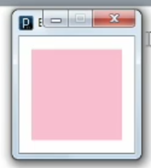
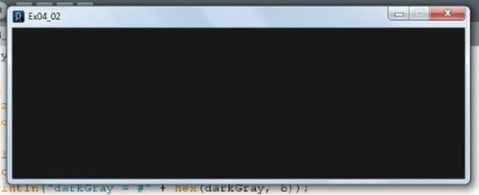
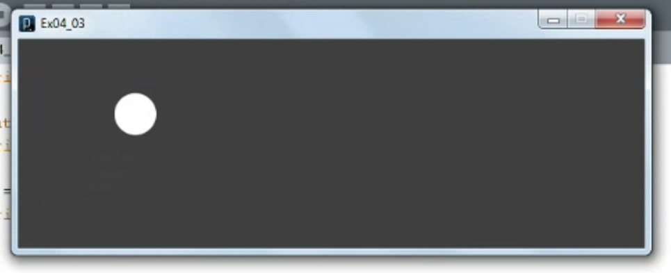
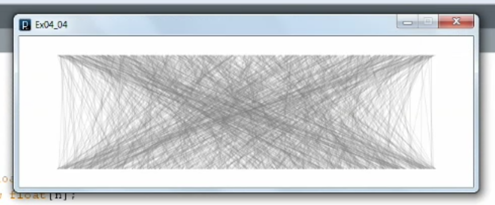
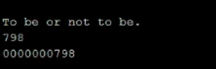

1. [Introduction to variables](#1)
2. [Understanding variable scope](#2)
3. [Modifying variables](#3)
4. [Creating arrays](#4)
5. [Modifying arrays](#5)
6. [Creating strings](#6)
7. [Modifying strings](#7)

---

### 1. Introduction to variables<a id="1"></a>



```js
// Ex04_01

// int variable
int x;  // Declared x
x = 10;  // Initialized x
//println(x);
println("x = " + x);

// float variable
float e = 2.71828;
println("e = " + e);

// boolean variable
boolean switchVar = true;
println("switchVar = " + switchVar);
switchVar = !switchVar;
println("switchVar = " + switchVar);

// char variable
char charVar = 'V';
println("charVar = " + charVar);

// byte variable
// arduino comm with serial port by sending bytes to pc
byte dozen = 12;
println("The byte variable \"dozen\" is equal to: " + dozen);

// color variable
color cherryBlossomPink = #FFB7C5;
background(cherryBlossomPink);
```

### 2. Understanding variable scope<a id="2"></a>



```js
// Ex04_02

// The are global variables
int x = 0;
int y = 50;
int z;

void setup() {
  size(600, 200);
  smooth();
  // This is a local variable
  color darkGray = #333333;
  background(darkGray);
  println("darkGray = #" + hex(darkGray, 6));
  float randomFloat1 = random(10);
  println("randomFloat1 = " + randomFloat1);
  z = 25;
}

void draw() {
  color darkGray = #111111;
  background(darkGray);
}
```

### 3. Modifying variables<a id="3"></a>



```js
// Ex04_03

int x = 10;
float y = 50;
float z;

void setup() {
  size(600, 200);
  smooth();
  noStroke();

  // Assign a new value to an existing variable
  y = height;

  // Casting a variable
  float randomFloat = random(10);
  println("randomFloat = " + randomFloat);

  int randomInt = int(random(11));
  println("randomInt = " + randomInt);

  int randomDie = int(random(6)) + 1;
  println("randomDie = " + randomDie);

  z = 3*x + atan(sqrt(y));
  println("z = " + z);

}

void draw() {
  background(#333333);
  ellipse(x, y, 40, 40);

  x++;
  y *= 0.99;

  x = constrain(x, 0, width/2);
}
```

- processing ref. constrain() [click me](https://processing.org/reference/constrain_.html)

### 4. Creating arrays<a id="4"></a>



```js
// Ex04_04

// Manually create an array
int[] a = {100, 200, 300, 400, 500};
//println("The five values in a[], from 0-4, are:");
//println(a);


// fill in an empty array
int[] b = new int[3];
println("\nb[] has not yet been filled in, so its default values are:");
println(b);
b[0] = 3;
b[1] = 6;
b[2] = 9;

println("\nNow the values of b[] are:");
println(b);


// Create lines
size(600, 200);
background(255);
smooth();
stroke(100, 50);

int n = 1000;
float[] xTop = new float[n];
float[] xBottom = new float[n];

for(int i = 0; i < n; i++) {
  xTop[i] = random(50, 550);
  xBottom[i] = random(50, 550);
  line(xTop[i], 25, xBottom[i], 175);
}
```

- processing ref. line() [click me](https://processing.org/reference/line_.html)

### 5. Modifying arrays<a id="5"></a>

```js
// Ex04_05

// Original
int[] a = {7, 0, 4};

// copy
int[] b = new int[a.length];
//println(b);
arrayCopy(a, b);
//println(b);

// sort
a = sort(a);
//println(a);

// reverse
int[] bRev = reverse(b);
//println(bRev);

// append
a = append(a, 8);
//println(a);

// splice
b = splice(b, 10, 2);
//println(b);

// concatenation
int[] c = concat(a, b);
println(c);
```

- processing ref. arrayCopy() [click me](https://processing.org/reference/arrayCopy_.html)
- processing ref. sort() [click me](https://processing.org/reference/sort_.html)
- processing ref. reverse() [click me](https://processing.org/reference/reverse_.html)
- processing ref. append() [click me](https://processing.org/reference/append_.html)
- processing ref. splice() [click me](https://processing.org/reference/splice_.html)
- processing ref. concat() [click me](https://processing.org/reference/concat_.html)

### 6. Creating strings<a id="6"></a>

1. Drag dummy.txt file on processing ide, this will create data-folder and place dummy.txt inside it for processing

```js
// Ex04_06

// Manually entering text
String deerHunterOntology = "This is this. It's not something else. This is this.";
//println(deerHunterOntology);

size(600, 200);
smooth();
background(#EEEEEE);
fill(#000000);
text(deerHunterOntology, 100, 140);

// how to load text file
String poemLines[] = loadStrings("Szymborska.txt");
println(poemLines[0]);
println(poemLines[1]);
```

- processing ref. loadStrings() [click me](https://processing.org/reference/loadStrings_.html)

### 7. Modifying strings<a id="7"></a>



```js
// Ex04_07

// trim()
String quote = "     To be or not to be.     ";
quote = trim(quote);
println(quote);

// nf()
int a = 798;
println(a);
String A = nf(a, 10);
println(A);
```

- processing ref. nf() [click me](https://processing.org/reference/nf_.html)
- processing ref. trim() [click me](https://processing.org/reference/trim_.html)
