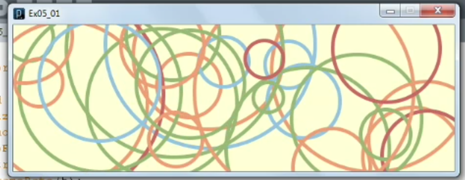
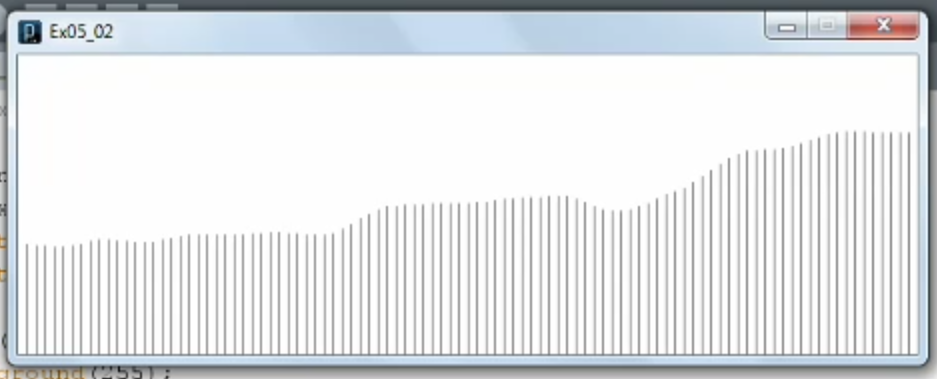
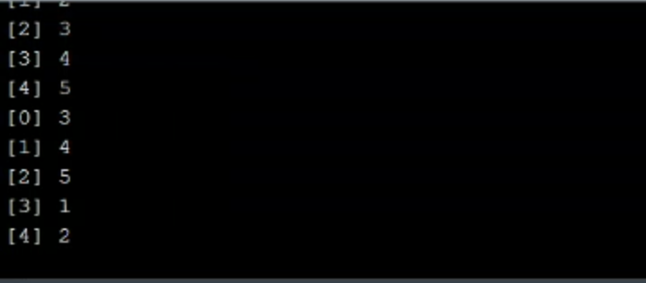
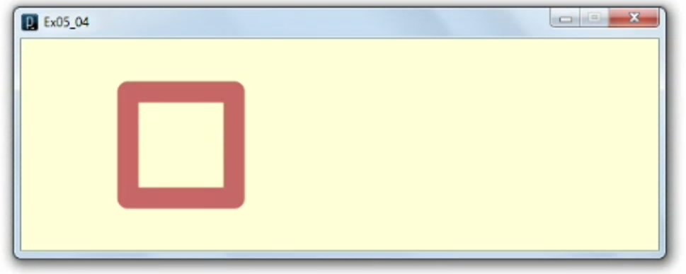
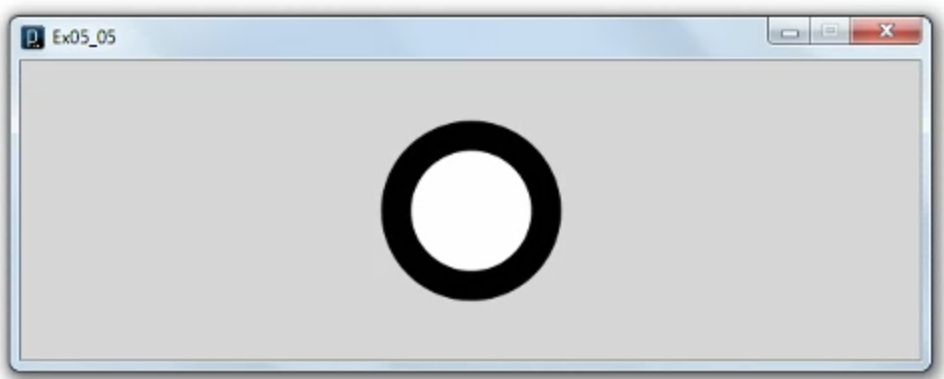
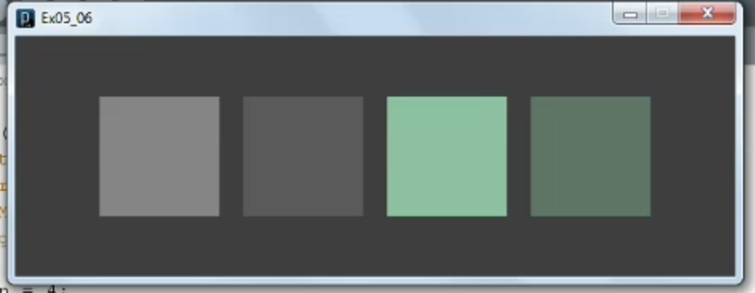
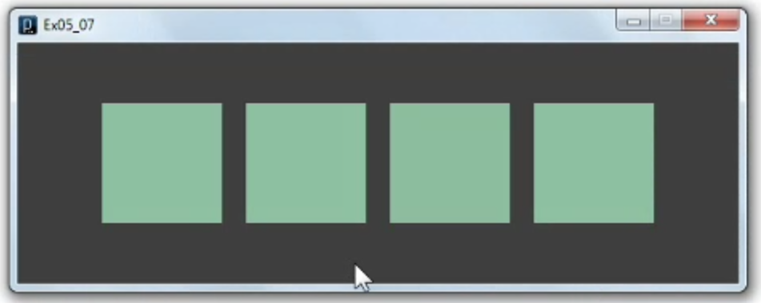
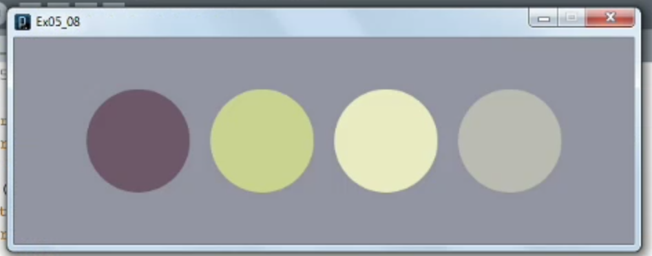
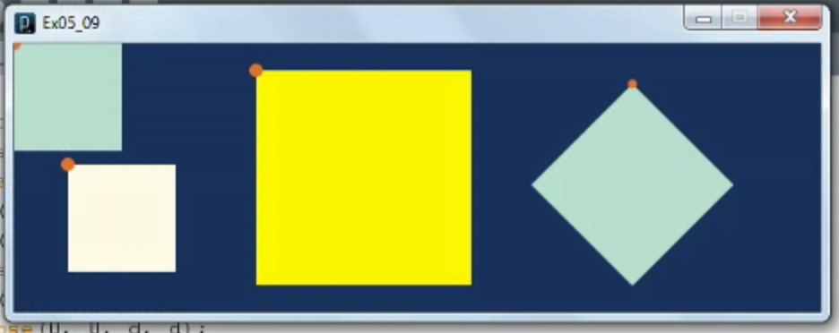
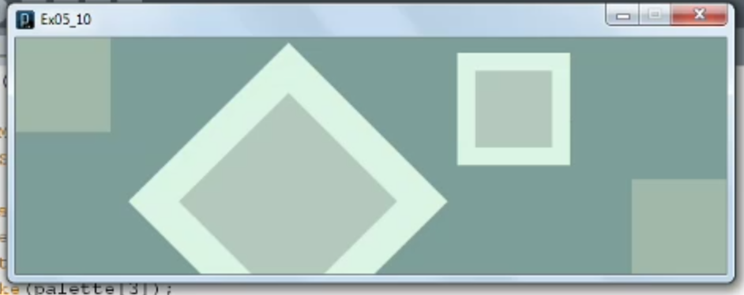

1. [Incorporating randomness](#1)
2. [Using Perlin noise](#2)
3. [Shuffling with Java](#3)
4. [Specifying line attributes](#4)
5. [Changing placement modes](#5)
6. [Understanding color attributes and functions](#6)
7. [Exploring color spaces](#7)
8. [Using color palettes](#8)
9. [Transforming the grid](#9)
10. [Exploring the attribute matrix](#10)

---

### 1. Incorporating randomness<a id="1"></a>



```js
// Ex05_01

color[] rainbow = {#FFFFCD, #CC5C54, #F69162, #85A562, #7AB5DB};

void setup(){
  size(600, 200);
  smooth();
  noFill();
  strokeWeight(5);
  frameRate(5);
  background(rainbow[0]);
}

void draw(){
  float x = random(width);
  float y = random(height);
  float d = random(30, 300);
//  stroke(random(255), random(255), random(255));
  stroke(rainbow[int(random(1, 5))]);
  ellipse(x, y, d, d);
}
```

- random() function reference documentation [click me](https://processing.org/reference/random_.html)

### 2. Using Perlin noise<a id="2"></a>



```js
// Ex05_02

int n = 100;
int x;
float y = .05;
float noiseY;

size(600, 200);
background(255);
stroke(100);

for(int i = 1; i < n; i++) {
  y += .02;
  x = i* (width/n);
  noiseY = noise(y) * height;
  line(x, height, x, noiseY);
}
```

- Perlin noise was developed by movie industry, as a way of creating very realistic and organic texture
- Algorithm to generate perlin noise.

### 3. Shuffling with Java<a id="3"></a>



```js
// Ex05_03

import java.util.*;

// Java way of declaring integer
Integer[] nums = {1, 2, 3, 4, 5};
println(nums);

Collections.shuffle(Arrays.asList(nums));
println(nums);
```

- using java library to shuffle array element

### 4. Specifying line attributes<a id="4"></a>



```js
// Ex05_04

color[] rainbow = {#FFFFCD, #CC5C54, #F69162, #85A562, #7AB5DB};

// make 600 pixel width, 200 pixel height
size(600, 200);
background(rainbow[0]);

// turn on anti-aliasing
smooth();
//noSmooth();

// make 20 pixel boundary thickness
strokeWeight(20);
stroke(rainbow[1]);

//strokeCap(ROUND);
//line(50, height*.25, 550, height*.25);
//
//strokeCap(SQUARE);
//line(50, height/2, 550, height/2);
//
//strokeCap(PROJECT);
//line(50, height*.75, 550, height*.75);

noFill();
//strokeJoin(MITER);
//strokeJoin(BEVEL);
strokeJoin(ROUND);
rect(100, 50, 100, 100);
```

#### Shape attributes functions

- smooth() function reference documentation [click me](https://processing.org/reference/smooth_.html)
- strokeWeight() function reference documentation [click me](https://processing.org/reference/strokeWeight_.html)
- strokeCap() function reference documentation [click me](https://processing.org/reference/strokeCap_.html)
- strokeJoin() function reference documentation [click me](https://processing.org/reference/strokeJoin_.html)

### 5. Changing placement modes<a id="5"></a>



```js
// Ex05_05

size(600, 200);
smooth();
strokeWeight(20);

//rectMode(CORNER);
//rectMode(CENTER);
//rectMode(CORNERS);
//rect(250, 50, 350, 150);

//ellipseMode(CENTER);
//ellipse(width/2, height/2, 100, 100);
//ellipseMode(CORNER);
//ellipse(250, 50, 100, 100);
//ellipseMode(CORNERS);
//ellipse(250, 50, 350, 150);
ellipseMode(RADIUS);

// draw ellipse in center, having 50 pixel wide and 50 pixel tall
ellipse(width / 2, height / 2, 50, 50);
```

- ellipseMode() function reference documentation [click me](https://processing.org/reference/ellipseMode_.html)
- rectMode() function reference documentation [click me](https://processing.org/reference/rectMode_.html)

### 6. Understanding color attributes and functions<a id="6"></a>



```js
// Ex05_06

size(600, 200);
smooth();

// no border on the shape
noStroke();
rectMode(CENTER);
background(50);

// number of rectangle
int n = 4;

// rectangle dividing lines
float x = width/(n+1);

fill(116);
rect(x*1, height/2, 100, 100);
fill(116, 100);
rect(x*2, height/2, 100, 100);
fill(116, 173, 146);
rect(x*3, height/2, 100, 100);
fill(116, 173, 146, 100);
rect(x*4, height/2, 100, 100);
```

- fill() function reference documentation [click me](https://processing.org/reference/fill_.html)

### 7. Exploring color spaces<a id="7"></a>



```js
// Ex06_07

size(600, 200);
smooth();
noStroke();
background(50);
rectMode(CENTER);

// no of rectangle that i want to draw
int n = 4;
// get center point of each rectangle
float x = width/(n+1);

colorMode(RGB);
fill(116, 173, 146);
rect(x*1, height/2, 100, 100);
fill(#74AD92);
rect(x*2, height/2, 100, 100);

colorMode(HSB, 360, 100, 100);
fill(151, 32, 67);
rect(x*3, height/2, 100, 100);

colorMode(HSB, 360, 255, 255);
fill(151, 84, 173);
rect(x*4, height/2, 100, 100);
```

- colorMode() function reference documentation [click me](https://processing.org/reference/colorMode_.html)

### 8. Using color palettes<a id="8"></a>



```js
// 05_08

color[] backstage = {#828594, #614B59, #BFC47D, #E3E2B3, #ADACA2};
color[] palette = backstage;

size(600, 200);
smooth();
noStroke();

background(palette[0]);
fill(palette[1]);
ellipse(120, height/2, 100, 100);
fill(palette[2]);
ellipse(240, height/2, 100, 100);
fill(palette[3]);
ellipse(360, height/2, 100, 100);
fill(palette[4]);
ellipse(480, height/2, 100, 100);
```

- colorbrewer: good for coloring map [click me](https://colorbrewer2.org/#type=sequential&scheme=BuGn&n=3)
- paletton: good for website; scroll down and click on example for previewing [click me](https://paletton.com/#uid=1000u0kllllaFw0g0qFqFg0w0aF)
- Adobe: good for pallet generator [click me](https://color.adobe.com/)

### 9. Transforming the grid<a id="9"></a>



```js
// Ex05_09

color[] chemistry = {#0C2550, #A3D0C1, #FDF6DD, #FEE406, #F4651C};
color[] palette = chemistry;

int s = 80;
int d = 10;

size(600, 200);
smooth();
noStroke();
background(palette[0]);

fill(palette[1]);
rect(0, 0, s, s);

fill(palette[4]);
ellipse(0, 0, d, d);

// translate: moving grid line origin
translate(40, 90);
fill(palette[2]);
rect(0, 0, s, s);
fill(palette[4]);
ellipse(0, 0, d, d);

// scale grid
translate(140, -70);
scale(2);
fill(palette[3]);
rect(0, 0, s, s);
scale(.5);
fill(palette[4]);
ellipse(0, 0, d, d);

// rotate grid
translate(280, 10);
scale(1.33);
rotate(PI*.25);
//rotate(radians(90));
fill(palette[1]);
rect(0, 0, s, s);
scale(.5);
fill(palette[4]);
ellipse(0, 0, d, d);
```

#### The invisible gridline function

- translate() function reference documentation [click me](https://processing.org/reference/translate_.html)
- scale() function reference documentation [click me](https://processing.org/reference/scale_.html)
- rotate() function reference documentation [click me](https://processing.org/reference/rotate_.html)

### 10 Exploring the attribute matrix<a id="10"></a>



```js
// Ex05_10

color[] crowds = {#678C8B, #8FA89B, #A2BAB0, #D0EDDE, #B38597};
color[] palette = crowds;

int s = 80;

size(600, 200);
smooth();
noStroke();
background(palette[0]);

fill(palette[1]);
rect(0, 0, s, s);

pushMatrix();
pushStyle();

translate(230, 25);
scale(2);
rotate(radians(45));
stroke(palette[3]);
strokeWeight(15);
fill(palette[2]);

rect(0, 0, s, s);

popMatrix();
rect(380, 20, s, s);

popStyle();
rect(width-s, height-s, s, s);
```

- pushMatrix() function reference documentation [click me](https://processing.org/reference/pushMatrix_.html)
- pushStyle() function reference documentation [click me](https://processing.org/reference/pushStyle_.html)
- popMatrix() function reference documentation [click me](https://processing.org/reference/popMatrix_.html)

note

- pushMatrix, pushStyle use to save orientation so i dont need to set up it again and again
