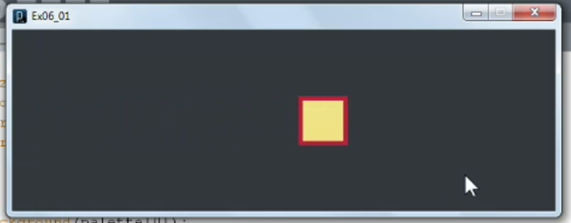
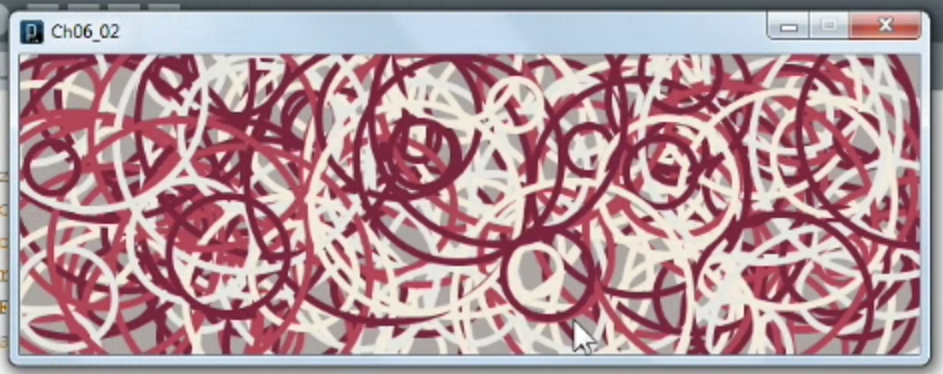
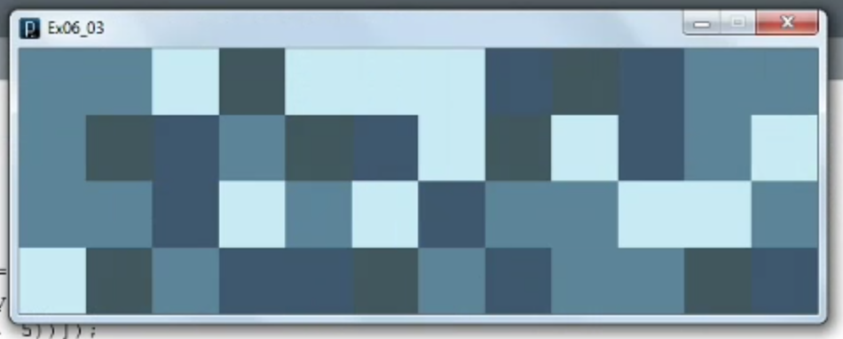
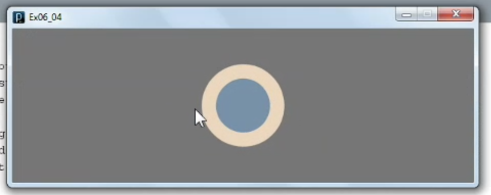
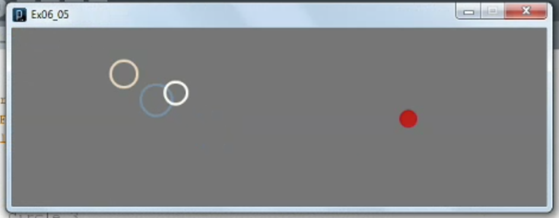
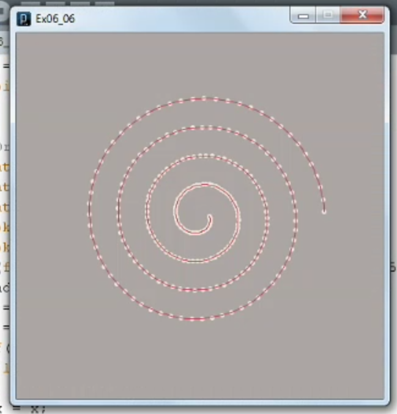

1. [Building code blocks](#1)
2. [Writing a while loop](#2)
3. [Using for loops](#3)
4. [Creating conditionals](#4)
5. [Working with easing](#5)
6. [Creating spirals](#6)

---

### 1 Building code blocks<a id="1"></a>



```js
// Ex06_01

color[] styleyou = {#262B30, #E09A25, #F0D770, #F2EDBC, #C51C30};
color[] palette = styleyou;

int i = 1;
int x = 0;

void setup(){
  size(600, 200);
  smooth();
  stroke(palette[4]);
  strokeWeight(5);
}

void draw(){
  background(palette[0]);
  fill(palette[i]);
  rect(x, 75, 50, 50);
}

void keyPressed(){
  x += 3;
}

void mousePressed(){
  i = int(random(1, 5));
}
```

#### Processing block aka function/method

- keypress(){ ... } block reference documentation [click me](https://processing.org/reference/keyPressed_.html)
- mousePressed(){ ... } block reference documentation [click me](https://processing.org/examples/mousepress.html)
- setup(){ ... } block reference documentation [click me](https://processing.org/reference/setup_.html)
- draw(){ ... } block reference documentation [click me](https://processing.org/reference/draw_.html)

### 2 Writing a while loop<a id="2"></a>



```js
// Ex06_02

color[] dessert = {#9F9694, #791F33, #BA3D49, #F1E6D4, #E2E1DC};
color[] palette = dessert;
float limiter = 0;

void setup(){
  size(600, 200);
  background(palette[0]);
  smooth();
  strokeWeight(5);
  noFill();
  frameRate(5);
}

void draw(){
  while(limiter < 100){
    stroke(palette[int(random(1, 5))]);
    float x = random(width);
    float y = random(height);
    float d = random(20, 200);
    ellipse(x, y, d, d);
    limiter += random(-1, +2);
  }
}
```

- while(){ ... } block reference documentation [click me](https://processing.org/reference/while.html)

### 3 Using for loops<a id="3"></a>



```js
// Ex06_03

color[] beach = {#D9C6B0, #314650, #2D4761, #45718C, #B6E1F2};
color[] palette = beach;

int s = 50;

void setup(){
  size(600, 200);
  background(palette[0]);
  smooth();
  noStroke();

  for(int x = 0; x < width; x += s){
    for(int y = 0; y < height; y += s) {
      fill(palette[int(random(1, 5))]);
      rect(x, y, s, s);
    }
  }
}

void draw(){
  fill(palette[int(random(1, 5))]);
  int x = int(random(width/s))*s;
  int y = int(random(height/s))*s;
  rect(x, y, s, s);
}
```

- for(){ ... } block reference documentation [click me](https://processing.org/reference/for.html)

### 4 Creating conditionals<a id="4"></a>



```js
// Ex06_04

color[] rainbow   = {#FFFFCD, #CC5C54, #F69162, #85A562, #7AB5DB};
color[] chemistry = {#0C2550, #A3D0C1, #FDF6DD, #FEE406, #F4651C};
color[] kitties   = {#302F2F, #74AD92, #F07F47, #FFAA42, #FFE224};
color[] beach     = {#D9C6B0, #314650, #2D4761, #45718C, #B6E1F2};
color[] cottage   = {#C3CCC8, #442412, #475D1C, #859356, #B9961C};
color[] minard    = {#666666, #607F9C, #E9CCAE, #FFFFF3, #D01312};
color[] palette   = minard;

int choice;
int p1 = 1;
int p2 = 2;

float x;
float y;
float d = 100;
float b = 10;

void setup(){
  size(600, 200);
  smooth();
  x = width/2;
  y = height/2;
}

void draw(){
  background(palette[0]);
  fill(palette[p1]);
  stroke(palette[p2]);
  strokeWeight(b);
  ellipse(x, y, d, d);

// if-else block
  if(mouseX > width/2){
    d += .5;
  } else {
    d -= .5;
  }

// ternary
  b = (mouseY > (height/2)) ? b + .1 : b - .1;
  b = constrain(b, 0, 50);
}

void keyPressed(){
  p1 = int(random(1, 5));
  p2 = int(random(1, 5));

// switch block
  int choice = key;
  switch(choice){
    case 49: // 1 key ASCII code
      palette = rainbow;
      break;
    case 50: // 2 key ASCII code
      palette = chemistry;
      break;
    case 51: // 3 key ASCII code
      palette = kitties;
      break;
    case 52: // 4 key ASCII code
      palette = beach;
      break;
    case 53: // 5 key ASCII code
      palette = cottage;
      break;
    case 54: // 6 key ASCII code
      palette = minard;
      break;
  }
}
```

- if(){ ... } block reference documentation [click me](https://processing.org/reference/if.html)
- if(){ ... }else{ ...} block reference documentation [click me](https://processing.org/reference/else.html)
- ternary block reference documentation [click me](https://processing.org/reference/conditional.html)
- switch(){ ... } block reference documentation [click me](https://processing.org/reference/switch.html)

### 5 Working with easing<a id="5"></a>



```js
// Ex06_05

color[] minard = {#666666, #607F9C, #E9CCAE, #FFFFF3, #D01312};
color[] palette = minard;

int wide = 600;
int high = 200;

int d = 20;

float x1 = random(wide);
float y1 = random(high);
float easing1 = .01;

float x2 = random(wide);
float y2 = random(high);
float easing2 = .03;

float x3 = random(wide);
float y3 = random(high);
float easing3 = .05;

void setup(){
  size(wide, high);
  smooth();
  strokeWeight(3);
//  cursor(ARROW);
//  cursor(CROSS);
//  cursor(HAND);
//  cursor(TEXT);
//  cursor(WAIT);
  noCursor();
}

void draw(){
  background(palette[0]);

  // Circle 1
  stroke(palette[1]);
  noFill();
  ellipse(x1, y1, d+15, d+15);
  x1 += (mouseX - x1)*easing1;
  y1 += (mouseY - y1)*easing1;

  // Circle 2
  stroke(palette[2]);
  noFill();
  ellipse(x2, y2, d+10, d+10);
  x2 += (mouseX - x2)*easing2;
  y2 += (mouseY - y2)*easing2;

  // Circle 3
  stroke(palette[3]);
  noFill();
  ellipse(x3, y3, d+5, d+5);
  x3 += (mouseX - x3)*easing3;
  y3 += (mouseY - y3)*easing3;

  // Dot on cursor
  noStroke();
  fill(palette[4]);
  ellipse(mouseX, mouseY, d, d);
}
```

- cursor() function reference documentation [click me](https://processing.org/reference/cursor_.html)
- Algorithm ease - cursor chaser

### 6 Creating spirals<a id="6"></a>



```js
// Ex06_06

color[] dessert = {#9F9694, #791F33, #BA3D49, #F1E6D4, #E2E1DC};
color[] palette = dessert;

float x, y;
float radiusCircle = 100;

size(400, 400);
translate(width/2, height/2);
background(palette[0]);
smooth();

// Draw a circle using ellipse
//ellipseMode(RADIUS);
//stroke(palette[1]);
//noFill();
//ellipse(0, 0, radiusCircle, radiusCircle);

// Draw a circle with points
//stroke(palette[4]);
//strokeWeight(5);
//for(float angle = 0; angle < 2*PI; angle += .1){
//  x = cos(angle) * radiusCircle;
//  y = sin(angle) * radiusCircle;
//  point(x, y);
//}

// Draw dots in a spiral
float radiusSpiralDots = 10;
stroke(palette[3]);
strokeWeight(5);
for(float angle = 0; angle < 8*PI; angle += .1){
  radiusSpiralDots += 0.5;
  x = cos(angle) * radiusSpiralDots;
  y = sin(angle) * radiusSpiralDots;
//  point(x, y);
}

// Draw a spiral line
float px = -999;
float py = -999;
float radiusSpiralLine = 10;
stroke(palette[2]);
strokeWeight(1);
for(float angle = 0; angle < 8*PI; angle += .05){
  radiusSpiralLine += 0.25;
  x = cos(angle) * radiusSpiralLine;
  y = sin(angle) * radiusSpiralLine;
  if(px > -999){
    line(x, y, px, py);
  }
  px = x;
  py = y;
}
```

- Algorithm Spiral
