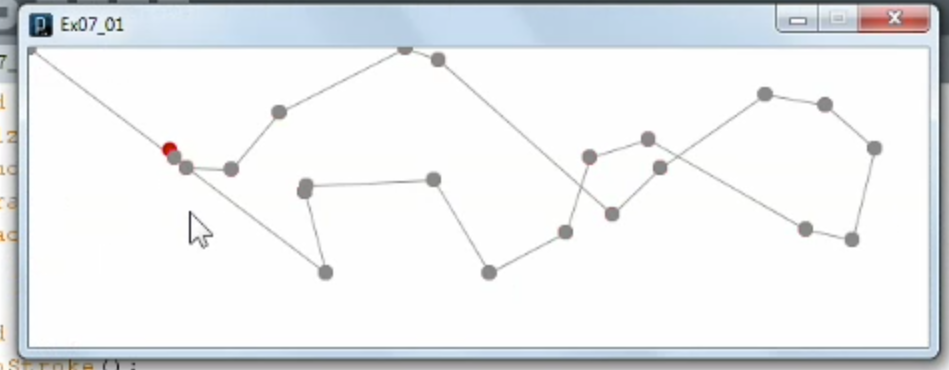
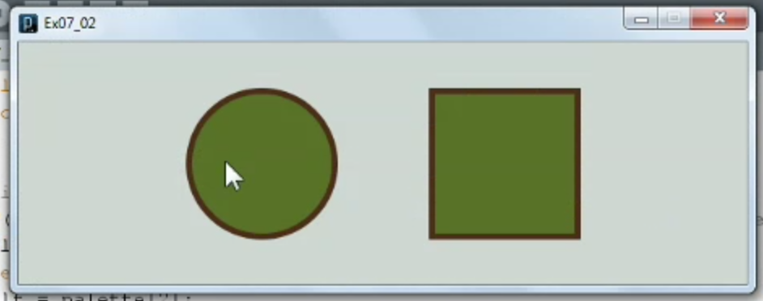
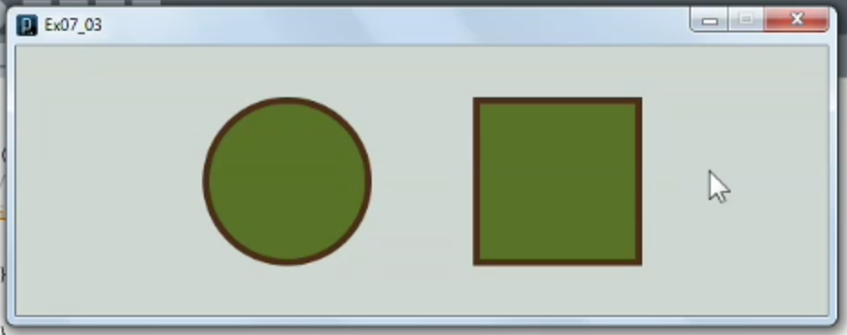

1. [Mouse tracking](#1)
2. [Hovering and clicking](#2)
3. [Understanding keyboard interaction](#3)

---

### 1. Mouse tracking<a id="1"></a>



```js
// 07_01

void setup(){
  size(600, 200);
  smooth();
  frameRate(8);
  background(255);
}

void draw(){
  noStroke();
  fill(220, 0, 0);
  ellipse(mouseX, mouseY, 10, 10);
  fill(120);
  ellipse(pmouseX, pmouseY, 10, 10);
  stroke(120);
  line(mouseX, mouseY, pmouseX, pmouseY);
}

void mousePressed(){
  // erase background
  background(255);
}
```

- mouseX, mouseY, pmouseX, pmouseY reference documentation [click me](https://processing.org/reference/mouseX.html)

### 2. Hovering and clicking<a id="2"></a>



```js
// Ex07_02

color[] cottage = {#C3CCC8, #442412, #475D1C, #859356, #B9961C};
color[] palette = cottage;

int lf = palette[2];
int rf = palette[2];

int s = 120;

void setup(){
  size(600, 200);
  smooth();
  rectMode(CENTER);
  stroke(palette[1]);
  strokeWeight(5);
}

void draw(){
  background(palette[0]);

  // Draw circle on left
  fill(lf);
  ellipse(width/3, height/2, s, s);

  // Draw square on right
  fill(rf);
  rect(width*2/3, height/2, s, s);

  // Detect hovering over circle
//  if(dist(width/3, height/2, mouseX, mouseY) < s/2){
  if((dist(width/3, height/2, mouseX, mouseY) < s/2) && mousePressed){
    lf = palette[4];
  } else {
    lf = palette[2];
  }

  // Detect hovering over square
//  if((mouseX > width*2/3-s/2) && (mouseX < width*2/3+s/2) &&
//     (mouseY > height/2-s/2) && (mouseY < height/2+s/2)){
  if((mouseX > width*2/3-s/2) && (mouseX < width*2/3+s/2) &&
     (mouseY > height/2-s/2) && (mouseY < height/2+s/2) &&
      mousePressed){
    rf = palette[4];
  } else {
    rf = palette[2];
  }
}
```

- Algorithm

### 3. Understanding keyboard interaction<a id="3"></a>



```js
// Ex07_03

color[] cottage = {#C3CCC8, #442412, #475D1C, #859356, #B9961C};
color[] palette = cottage;

int lf = palette[2];
int rf = palette[2];

int s = 120;

void setup(){
  size(600, 200);
  smooth();
  rectMode(CENTER);
  stroke(palette[1]);
  strokeWeight(5);
}

void draw(){
  background(palette[0]);

  // Draw circle on left
  fill(lf);
  ellipse(width/3, height/2, s, s);

  // Draw square on right
  fill(rf);
  rect(width*2/3, height/2, s, s);

  // Detect if any key is pressed
  if(keyPressed){
    // Click "l" key
    if(key == 'l'){
      lf = palette[4];
    } else {
      lf = palette[2];
    }

    // click "r" key
    if(key == 'r'){
      rf = palette[4];
    } else {
      rf = palette[2];
    }
  }
}
```

- keyPressed(){ ... } block reference documentation [click me](https://processing.org/reference/keyPressed_.html)
