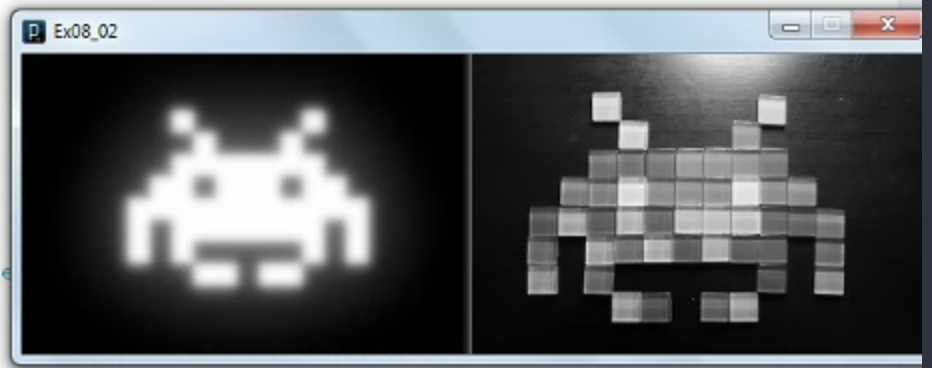
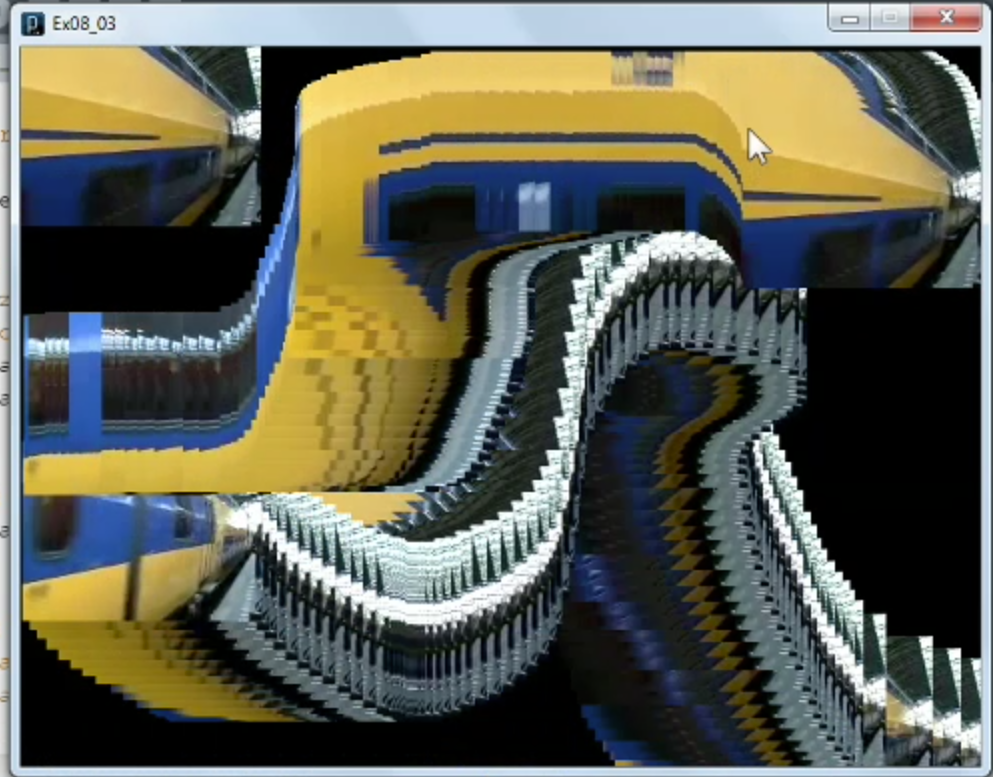
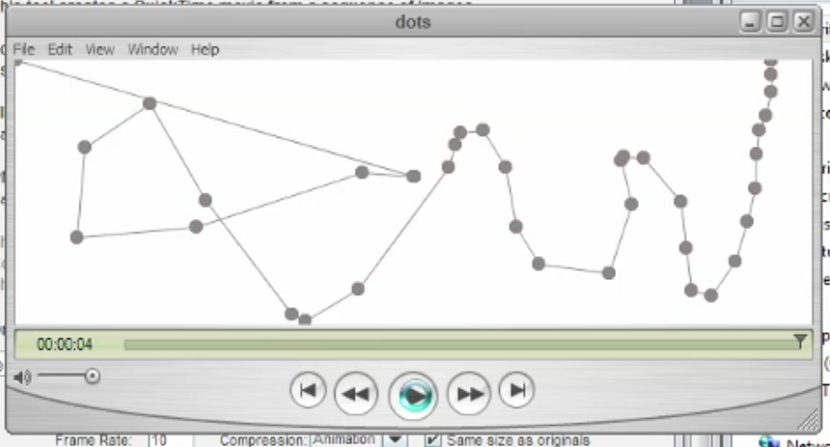
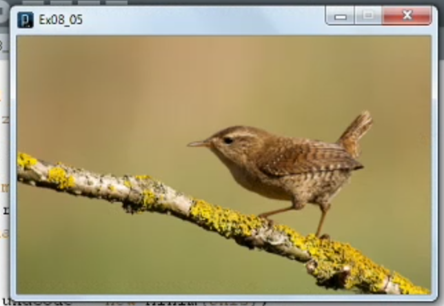

1. [Specifying fonts](#1)
2. [Using images](#2)
3. [Playing a video loop](#3)
4. [Exporting video](#4)
5. [Adding sound](#5)

---

### 1 App: Specifying fonts<a id="1"></a>


- Create font file: Processing toolbar--> Tools--> create Font--> "select"--> ok
- the generated font file is located in data-folder

```js
// Ex08_01

// The basic version
//size(600, 200);
//background(0);
//String wordText = "A word is worth 1/1000th of a picture.";
//text(wordText, 50, height/2);

// The elaborate version
size(600, 200);
background(#302F2F);

// create font obj
PFont sampleFont;
String wordText = "A word is worth 1/1000th of a picture.\nOr something like that.";
sampleFont = loadFont("GillSansMT-20.vlw");
textFont(sampleFont);
fill(#FFE224);
textAlign(LEFT, CENTER);
textLeading(50);
text(wordText, 50, height/2);
```

- PFont() function reference documentation [click me](https://processing.org/reference/PFont.html)
- loadFont() function reference documentation [click me](https://processing.org/reference/loadFont_.html)
- textFont() function reference documentation [click me](https://processing.org/reference/textFont_.html)
- textAlign() function reference documentation [click me](https://processing.org/reference/textAlign_.html)
- textLeading() function reference documentation [click me](https://processing.org/reference/textLeading_.html)

### 2 App: Using images<a id="2"></a>



- Drag & drop image-file from resource-folder to processing IDE
- the image-file is located in data-folder

```js
// Ex08_02

size(600, 200);
// Create image variable for obj
PImage spaceInvader;
// How to load image from hard disk
spaceInvader = loadImage("SpaceInvaderRed.jpg");
image(spaceInvader, 0, 0);
// filter apply on/over/after image is drawn
filter(BLUR, 3);

// Create image variable for obj
PImage webInvader;
// How to load image from web
String url = "http://farm3.staticflickr.com/2397/2148858093_0b469eeb97.jpg";
webInvader = loadImage(url);
// image() takes 5 args
// 1 image
// 2 x-coordinate
// 3 y-coordinate
// 4 x-coordinate (resize pixel)
// 2 y-coordinate (resize pixel)
image(webInvader, 300, 0, 300, 200);
filter(GRAY);
```

- PImage() function reference documentation [click me](https://processing.org/reference/PImage.html)
- loadImage() function reference documentation [click me](https://processing.org/reference/loadImage_.html)
- image() function reference documentation [click me](https://processing.org/reference/image_.html)
- filter() function reference documentation [click me](https://processing.org/reference/filter_.html)

note

- Apply filter after the image is drawn because filter is applied over the image

### 3 App: Playing a video loop<a id="3"></a>



- Import video library: Go to processing toolbar--> sketch--> Import library--> video
- drag & drop station-video from resource-folder to processing IDE

```js
// Ex08_03

import processing.video.*;

// create movie variable for obj
Movie trainMovie;

void setup() {
  size(640, 480);
  background(0);
  // How to load video
  trainMovie = new Movie(this, "station.mov");
  trainMovie.loop();
}

void movieEvent(Movie trainMovie) {
  trainMovie.read();
}

void draw() {
  image(trainMovie, 0, 0);
  image(trainMovie, mouseX, mouseY);
}
```

- Movie() function reference documentation [click me](https://processing.org/reference/libraries/video/Movie.html)
- loop() function reference documentation [click me](https://processing.org/reference/libraries/video/Movie_loop_.html)
- read() function reference documentation [click me](https://processing.org/reference/libraries/video/Movie_read_.html)

### 4 App: Exporting video<a id="4"></a>



```js
// Ex08_04
// Based on Ex07_01

void setup() {
  size(600, 200);
  frameRate(10);
  background(255);
}

void draw() {
  noStroke();
  fill(220, 0, 0);
  ellipse(mouseX, mouseY, 10, 10);
  fill(120);
  ellipse(pmouseX, pmouseY, 10, 10);
  stroke(120);
  line(mouseX, mouseY, pmouseX, pmouseY);

  // saving as movie file
  saveFrame("frames/####.png");          // This is the only new line
}

void mousePressed() {
  background(255);
}
```

#### How to use processing movie maker

- run sketch and close the window
- now go to project folder--> frames
- Go to processing toolbar--> tools--> Movie maker

##### settings

- Drag folder ... :drag & drop "frames" folder
- frame Rate: 10
- ✅Same size as original
- Create Movie

- saveFrame() function reference documentation [click me](https://processing.org/reference/saveFrame_.html)

### 5 App: Adding sound<a id="5"></a>



- Import minim library: Go to processing toolbar--> sketch--> Import library--> minim
- drag & drop bird.png, bird.wav files to processing IDE

```js
// Ex08_05

import ddf.minim.*;
import ddf.minim.signals.*;
import ddf.minim.analysis.*;
import ddf.minim.effects.*;

Minim soundCode;
AudioPlayer birdSong;

void setup(){
  size(400, 250);

  // Picture
  PImage bird;
  bird = loadImage("bird.png");
  image(bird, 0, 0, width, height);

  // Sound
  soundCode = new Minim(this);
  birdSong = soundCode.loadFile("bird.wav");
  birdSong.play();
}

void stop() {
  birdSong.close();
  soundCode.stop();
  super.stop();
}
```

- Sound library reference documentation Processing 3.0 [click me](https://processing.org/reference/libraries/sound/index.html)

- obsolete: beadsproject.net, minim library processing 2.0
