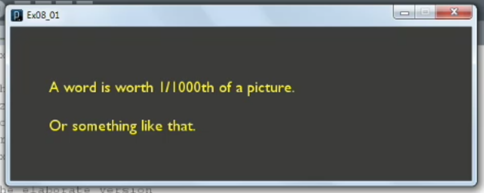

1. [Specifying fonts](#1)
2. [Using images](#2)
3. [Playing a video loop](#3)
4. [Exporting video](#4)
5. [Adding sound](#5)

---

### 1. Specifying fonts<a id="1"></a>



```js
// Ex08_01

// The basic version
//size(600, 200);
//background(0);
//String wordText = "A word is worth 1/1000th of a picture.";
//text(wordText, 50, height/2);

// The elaborate version
size(600, 200);
background(#302F2F);

PFont sampleFont;
String wordText = "A word is worth 1/1000th of a picture.\nOr something like that.";
sampleFont = loadFont("GillSansMT-20.vlw");
textFont(sampleFont);
fill(#FFE224);
textAlign(LEFT, CENTER);
textLeading(50);
text(wordText, 50, height/2);
```

- ellipse() function reference documentation [click me]()

### 2. Using images<a id="2"></a>


```js
// Ex08_02

size(600, 200);
PImage spaceInvader;
spaceInvader = loadImage("SpaceInvaderRed.jpg");
image(spaceInvader, 0, 0);
filter(BLUR, 3);

PImage webInvader;
String url = "http://farm3.staticflickr.com/2397/2148858093_0b469eeb97.jpg";
webInvader = loadImage(url);
image(webInvader, 300, 0, 300, 200);
filter(GRAY);
```

- ellipse() function reference documentation [click me]()

### 3. Playing a video loop<a id="3"></a>


```js
// Ex08_03

import processing.video.*;

Movie trainMovie;

void setup() {
  size(640, 480);
  background(0);
  trainMovie = new Movie(this, "station.mov");
  trainMovie.loop();
}

void movieEvent(Movie trainMovie) {
  trainMovie.read();
}

void draw() {
  image(trainMovie, 0, 0);
  image(trainMovie, mouseX, mouseY);
}
```

- ellipse() function reference documentation [click me]()

### 4. Exporting video<a id="4"></a>


```js
// Ex08_04
// Based on Ex07_01

void setup() {
  size(600, 200);
  frameRate(10);
  background(255);
}

void draw() {
  noStroke();
  fill(220, 0, 0);
  ellipse(mouseX, mouseY, 10, 10);
  fill(120);
  ellipse(pmouseX, pmouseY, 10, 10);
  stroke(120);
  line(mouseX, mouseY, pmouseX, pmouseY);
  saveFrame("frames/####.png");          // This is the only new line
}

void mousePressed() {
  background(255);
}
```

- ellipse() function reference documentation [click me]()

### 5. Adding sound<a id="5"></a>


```js
// Ex08_05

import ddf.minim.*;
import ddf.minim.signals.*;
import ddf.minim.analysis.*;
import ddf.minim.effects.*;

Minim soundCode;
AudioPlayer birdSong;

void setup(){
  size(400, 250);

  // Picture
  PImage bird;
  bird = loadImage("bird.png");
  image(bird, 0, 0, width, height);

  // Sound
  soundCode = new Minim(this);
  birdSong = soundCode.loadFile("bird.wav");
  birdSong.play();
}

void stop() {
  birdSong.close();
  soundCode.stop();
  super.stop();
}
```

- ellipse() function reference documentation [click me]()
