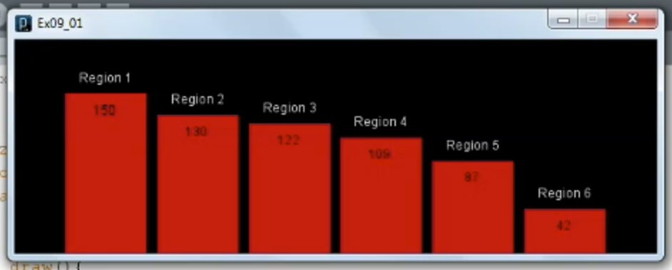

1. [Creating functions](#1)
2. [Creating classes and objects](#2)

---

### 1 App: Creating functions<a id="1"></a>



```js

```

- ellipse() function reference documentation [click me]()

### 2 App: Creating classes and objects<a id="2"></a>


```js

```

- ellipse() function reference documentation [click me]()
