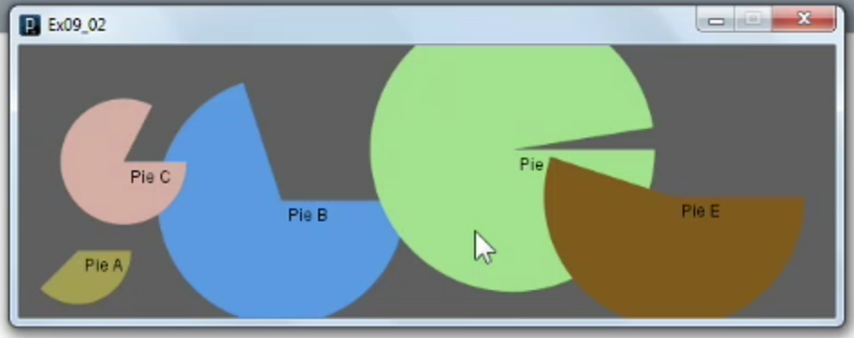

1. [Creating functions](#1)
2. [Creating classes and objects](#2)

---

### 1 App: Creating functions<a id="1"></a>


1. Create new sketch name it main or anything

```js
// Ex09_01

void setup(){
  size(600, 200);
  smooth();
  frameRate(2);
}

void draw(){
  background(0);
//  pacMan();
  bar(1, 6, 150, "Region 1");
  bar(2, 6, 130, "Region 2");
  bar(3, 6, 122, "Region 3");
  bar(4, 6, 109, "Region 4");
  bar(5, 6,  87, "Region 5");
  bar(6, 6,  42, "Region 6");
}
```

---

2. create new tab in processing name it 'pacMan' and make it open

```js
// Define the pacMan() function
void pacMan(){
  noStroke();
  float x = random(width);
  float y = random(height);
  float d = random(20, 100);
  fill(#FFEF00);
  arc(x, y, d, d, PI*0.2, PI*1.8);
}
```

---

3. create new tab in processing name it 'barGraph' and make it open

```js
// barGraph function
void bar(int i, int n, int outcome, String label){

  // Calculate the values for the bars
  int x = int(width*i/(n+1)); // Calculate the x coordinate for each bar
  int spaceBars = 20; // Sets space between bars in pixels
  float wide = (width - spaceBars*(n+1))/n;

  // Draw the bars
  rectMode(CENTER);
  noStroke();
  fill(220, 10, 10);
  rect(x, height-outcome/2, wide, outcome);

  // Draw the labels
  textAlign(CENTER);
  fill(200);
  text(label, x, height-outcome-10);
  fill(0);
  text(outcome, x, height-outcome+20);
}
```

- Pi look like packman

### 2 App: Creating classes and objects<a id="2"></a>



1. Create new sketch name it main or anything

```js
// Ex09_02

PieGrow pie1;
PieGrow pie2;
PieGrow pie3;
PieGrow pie4;
PieGrow pie5;

void setup() {
  size(600, 200);
  smooth();

  // PieGrow(title, PI);
  pie1 = new PieGrow("Pie A", 0.75);
  pie2 = new PieGrow("Pie B", 1.40);
  pie3 = new PieGrow("Pie C", 1.65);
  pie4 = new PieGrow("Pie D", 1.95);
  pie5 = new PieGrow("Pie E", 1.10);
}

void draw() {
  background(80);

  pie1.update();
  pie1.display();

  pie2.update();
  pie2.display();

  pie3.update();
  pie3.display();

  pie4.update();
  pie4.display();

  pie5.update();
  pie5.display();
}
```

---

2. create new tab in processing name it 'PieGrow' and make it open

```js
class PieGrow {

  // Declare variables
  float x;
  float y;
  float d;
  float angleStart;
  float angleMid;
  float angleEnd;
  float speed;
  float r;
  float g;
  float b;
  String title;

  // Constructor to set initial values
  PieGrow(String titleTemp, float angleEndTemp) {
     d = random(50, 250);
     x = random(d/2, width-d/2);
     y = random(d/2, height-d/2);
     angleStart = 0;
     angleMid = 0;
     angleEnd = angleEndTemp * PI;
     speed = random(.005, .05);
     r = random(255);
     g = random(255);
     b = random(255);
     title = titleTemp;

  }

  // Update fields
  void update() {
    angleMid += speed;
    angleMid = constrain(angleMid, 0, angleEnd);

    if((dist(x, y, mouseX, mouseY) < d/2) && mousePressed) {
      x = x + (mouseX - pmouseX);
      y = y + (mouseY - pmouseY);
    }
  }

  // Draw the arc
  void display() {
    noStroke();
    fill(r, g, b);
    arc(x, y, d, d, 0, angleMid);
    fill(0);
    text(title, x+5, y+15);
  }
}
```
